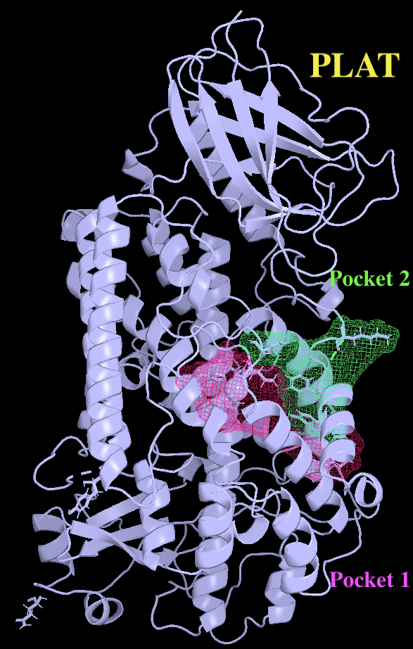

# Molecular-dynamics-simulations-of-human-5-lipoxygenase

###Overview

This repository contains thei analysis data from  molecular dynamics trajectories (GROMACS) used to investigate the allosteric regulation of human 5-lipoxygenase (5-LOX) by ATP.
The results are based on over 12.2 μs of atomistic molecular dynamics simulations.

Using extensive multi-replica molecular dynamics simulations together with structural and statistical analyses, this project explores how ATP binding remodels the conformational landscape of 5-LOX, alters PLAT-domain dynamics, reshapes catalytic pocket accessibility, and reorganizes long-range interaction networks.

  

###Software

GROMACS
Python
NumPy
SciPy
Pandas
Matplotlib
PyMOL

